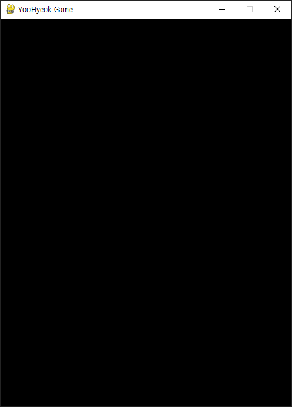
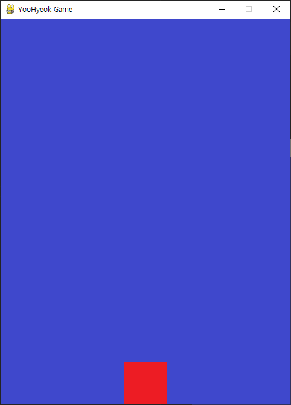

# 나도 코딩 Python 활용 1 - 추억의 오락실 게임만들기

## pygame 라이브러리 활용
pygame이란?  
파이썬에서 2D 게임 및 멀티미디어 애플리케이션을 개발할 수 있도록 해주는 오픈소스 라이브러리

- pygame 라이브러리 설치 명령
  ```bash
  pip install pygame
  ```
## 01) 기본기
<details>
<summary>접기/펼치기</summary>
<br>

### pygame 예제1) 기본 프레임 설정, 이벤트루프 설정

#### 전체 코드
- [1_create_frame.py](pygame_basic/1_create_frame.py)
  ```py
  import pygame

  pygame.init() # 초기화 (반드시 필요)

  # 화면 크기 설정
  screen_width = 480 # 가로 크기
  screen_height = 640 # 세로 크기
  screen = pygame.display.set_mode((screen_width, screen_height))

  # 화면 타이틀 설정
  pygame.display.set_caption("YooHyeok Game") # 게임 이름

  # 이벤트 루프: 실행되는 동안 발생하는 이벤트를 계속 감지하고 처리
  running = True # 게임 진행중 여부 Flag
  while running:
    for event in pygame.event.get(): # pygame에서 발생하는 모든 이벤트 추출
      if event.type == pygame.QUIT: # 게임창의 [X] 버튼을 통한 종료 이벤트
        running = False

  # pygmae 종료
  pygame.quit()
  ```

#### 코드 분석
1. 라이브러리 import
    ```py
    pygame import
    ```
2. 라이브러리 객체 초기화
    ```py
    pygame.init()
    ```
3. 캔버스 객체 Surface 변수 할당(화면 설정)
    ```py
    screen = pygame.display.set_mode((width, height))
    ```
4. 화면 타이틀 설정
    ```py
    pygame.display.set_caption("타이틀")
    ```
5. 이벤트루프 설정
    ```py
    running = True # 게임 진행중 여부 Flag
    while running:
      for event in pygame.event.get(): # pygame에서 발생하는 모든 이벤트 추출
        if event.type == pygame.QUIT: # 게임창의 [X] 버튼을 통한 종료 이벤트
          running = False
    ```
6. pygame 종료
    ```py
    pygame.quit()
    ```

<br>
<hr>
<br>

### 예제2) 배경 채우기


배경을 적용하는 방식으로는 이미지 파일 로드인 blit()과 색상 채우기 fill() 2가지 방식이 있다.  
두 방식 모두 이벤트 루프를 구현한 while문 내에서 실시간으로 호출한다.  
while 외부에서 처리할 수 있으나, 매 프레임 화면을 처음부터 다시 구성하기 위함이다.  
정적인 배경이 아닌, 캐릭터의 경우 매 프레임마다 움직이기 때문에 while에 적용한다.  
이때, 배경이 정적인 프레임이라고 하더라도, 캐릭터가 움직일 때 배경을 다시 그리지 않는다면,  
이전 위치에 있던 캐릭터 그림이 지워지지 않아 잔상이 남을 수 있다.  
따라서, 화면 내 모든 프레임은 실시간으로 그려지도록 while 루프에서 호출한다.  

#### 이미지) blit()
1. background 변수에 이미지 파일 경로 할당
2. Surface 객체를 할당한 변수 screen에 blit(file, axis) 함수에 매개변수로 전달
    - 첫번째 매개변수에 이미지파일 경로 할당
    - 두번째 매개변수에 이미지를 출력할 초기 시작 좌표 할ㄶ한 while문 당.
3. 게임 실행 루프내에서 blit() 함수 호출
4. 전체 화면 또는 일부 영역을 갱신을 위해 루프내에서 pygame.display.update() 호출

- [2_background.py](pygame_basic/2_background.py)
  ```py
  # 생략) pygame import 및 초기화, 화면 설정 및 Surface 객체 변수 할당

  # 배경 이미지 불러오기
  background = pygame.image.load('C:\\Users\\~\\pygame_basic\\background.png')

  # 이벤트 루프
  while running:
    # 생략 ()
    screen.blit(background, (0, 0)) # 배경 이미지 불러오기 - 튜플 (x좌표, y좌표)
    pygame.display.update() # 게임 화면 다시 그리기

  # 생략
  ```

#### 색상 fill()
1. background 변수에 이미지 파일 경로 할당
2. Surface 객체를 할당한 변수 screen에 blit(file, axis) 함수에 매개변수로 전달
    - 첫번째 매개변수에 이미지파일 경로 할당
    - 두번째 매개변수에 이미지를 출력할 초기 시작 좌표 할당.
3. 게임 실행 루프내에서 fill(rgb) 함수 호출
4. 전체 화면 또는 일부 영역을 갱신을 위해 루프내에서 pygame.display.update() 호출

- [2_background.py](pygame_basic/2_background.py)
  ```py
  # 생략) pygame import 및 초기화, 화면 설정 및 Surface 객체 변수 할당

  # 배경 이미지 불러오기
  background = pygame.image.load('C:\\Users\\~\\pygame_basic\\background.png')

  # 이벤트 루프
  while running:
    # 생략 (실제 event 루프 - for)
    screen.fill((0, 0, 255)) # 배경 색상으로 채우기
    pygame.display.update() # 게임 화면 다시 그리기

  # 생략
  ```

<br>
<hr>
<br>

### 예제3) 캐릭터 출력


1. character 변수에 이미지 파일 경로 할당
2. Surface 객체를 할당한 변수 screen에 blit(file, axis) 함수에 매개변수로 전달
    - 첫번째 매개변수에 이미지파일 경로 할당
    - 두번째 매개변수에 이미지를 출력할 초기 시작 좌표 할당.  
      가로: 화면 기준 중앙 / 세로: 화면 기준 최하단
3. 게임 실행 루프내에서 blit() 함수 호출
4. 전체 화면 또는 일부 영역을 갱신을 위해 루프내에서 pygame.display.update() 호출

- [3_main_sprite.py](pygame_basic/3_main_sprite.py)
  ```py
  # 생략) pygame import 및 초기화, 화면 설정 및 Surface 객체 변수 할당, 배경 이미지 불러오기

  # 스프라이트(캐릭터) 이미지 불러오기
  character = pygame.image.load('C:\\Users\\~\\pygame_basic\\character.png')
  # 스프라이트(캐릭터) 출력 위치 지정
  character_size = character.get_rect().size # 이미지 크기 반환
  character_width = character_size[0] # 가로
  character_height = character_size[1] # 세로
  character_x_pos = (screen_width / 2) - (character_height / 2) # 가로 위치(화면기준 중앙) : 
  character_y_pos = screen_height - character_height # 세로 위치(화면 기준 최하단)

  # 이벤트 루프
  while running:
    # 생략
    screen.blit(character, (character_x_pos, character_y_pos)) # 캐릭터 이미지 불러오기 - 튜플 (x좌표, y좌표)
    pygame.display.update() # 게임 화면 다시 그리기

  # 생략
  ```

<br>
<hr>
<br>

### 예제4) 캐릭터 이동: 키보드 이벤트


1. 이벤트 루프 - 방향키
   - 키 입력 : x, y좌표 이동 값(5) 제어
   - 키 해제 : 좌표 이동 stop
2. 가로,세로 영역 임계값 처리

- [4_keyboard_event.py](pygame_basic/4_keyboard_event.py)
  ```py
  # 이동할 좌표값
  to_x = 0
  to_y = 0

  # 생략
  while running:
    for event in pygame.event.get(): # pygame에서 발생하는 모든 이벤트 추출

      # 생략

      # 방향키 제어
      ## 키보드 입력 - 좌표 이동 start(5px)
      if event.type == pygame.KEYDOWN: 
        if event.key == pygame.K_LEFT: # 캐릭터 왼쪽 이동
          to_x -= 5
        elif event.key == pygame.K_RIGHT: # 캐릭터 오른쪽 이동
          to_x += 5
        elif event.key == pygame.K_UP: # 캐릭터 위로 이동
          to_y -= 5
        elif event.key == pygame.K_DOWN: # 캐릭터 아래로 이동
          to_y += 5
      ## 키보드 입력 해제 - 좌표 이동 stop
      if event.type == pygame.KEYUP: 
        if event.key == pygame.K_LEFT or event.key == pygame.K_RIGHT:
          to_x = 0
        elif event.key == pygame.K_UP or event.key == pygame.K_DOWN:
          to_y = 0
      
    character_x_pos += to_x
    character_y_pos += to_y

    # 임계값 처리
    ## 가로
    if character_x_pos < 0:
      character_x_pos = 0
    elif character_x_pos > screen_width - character_width: # 우측 최대 위치 입계값 : 스크린 가로너비 - 캐릭터 가로너비
      character_x_pos = screen_width - character_width
    ## 세로
    if character_y_pos < 0:
      character_y_pos = 0
    elif character_y_pos > screen_height - character_height: # 하단 최대 위치 입계값 : 스크린 세로높이 - 캐릭터 세로높이
      character_y_pos = screen_height - character_height
    
  # 생략
  ```

</details>
<br>
<hr>
<br>

## 02) 퀴즈(똥피하기)
<details>
<summary>접기/펼치기</summary>
<br>

</details>
<br>
<hr>
<br>

## 03) 프로젝트(오락실 팡 게임)
<details>
<summary>접기/펼치기</summary>
<br>

</details>
<br>
<hr>
<br>

