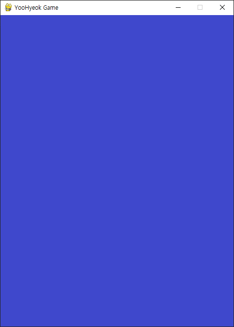
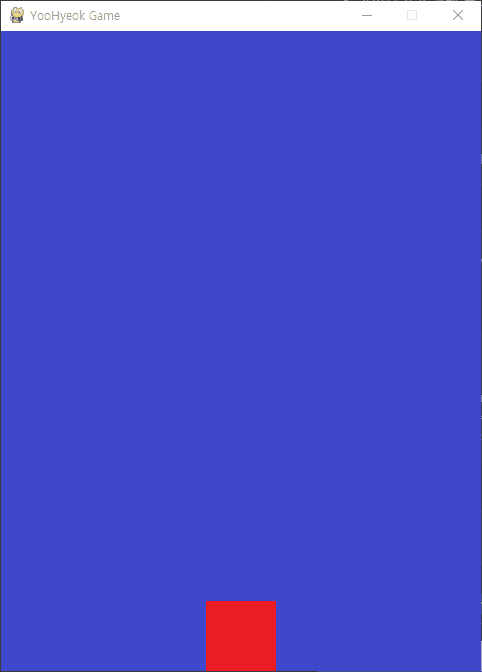
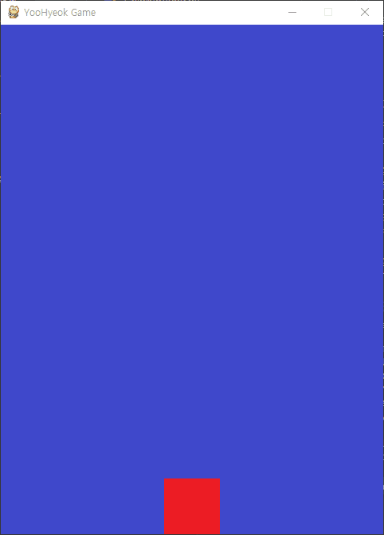
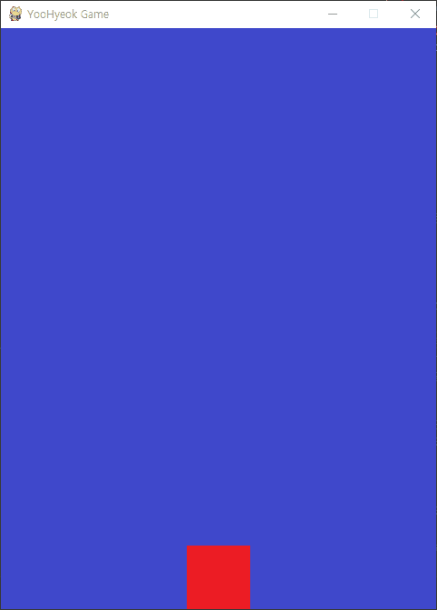
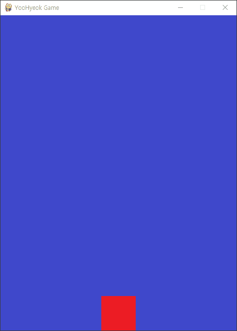
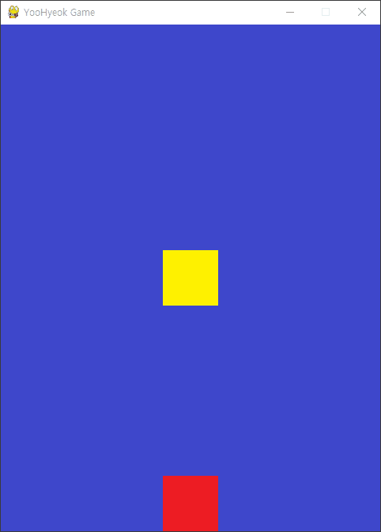
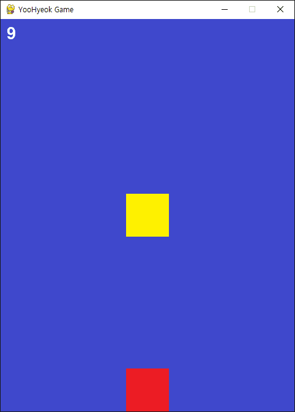

# [루트/README.md](../README.md)
# [프로젝트: 오락실 팡 게임](../pygame_project/README.md)

# 예제1) 환경설정 & 프레임
## 목차
1. 기본 프레임 설정
2.  이벤트루프 설정

<br>
<details>
<summary>접기/펼치기</summary>
<br>


## 전체 코드
- [1_create_frame.py](../1_create_frame.py)
  ```py
  import pygame

  pygame.init() # 초기화 (반드시 필요)

  # 화면 크기 설정
  screen_width = 480 # 가로 크기
  screen_height = 640 # 세로 크기
  screen = pygame.display.set_mode((screen_width, screen_height))

  # 화면 타이틀 설정
  pygame.display.set_caption("YooHyeok Game") # 게임 이름

  # 이벤트 루프: 실행되는 동안 발생하는 이벤트를 계속 감지하고 처리
  running = True # 게임 진행중 여부 Flag
  while running:
    for event in pygame.event.get(): # pygame에서 발생하는 모든 이벤트 추출
      if event.type == pygame.QUIT: # 게임창의 [X] 버튼을 통한 종료 이벤트
        running = False

  # pygmae 종료
  pygame.quit()
  ```

## 코드 분석
1. 라이브러리 import
    ```py
    pygame import
    ```
2. 라이브러리 객체 초기화
    ```py
    pygame.init()
    ```
3. 캔버스 객체 Surface 변수 할당(화면 설정)
    ```py
    screen = pygame.display.set_mode((width, height))
    ```
4. 화면 타이틀 설정
    ```py
    pygame.display.set_caption("타이틀")
    ```
5. 이벤트루프 설정
    ```py
    running = True # 게임 진행중 여부 Flag
    while running:
      for event in pygame.event.get(): # pygame에서 발생하는 모든 이벤트 추출
        if event.type == pygame.QUIT: # 게임창의 [X] 버튼을 통한 종료 이벤트
          running = False
    ```
6. pygame 종료
    ```py
    pygame.quit()
    ```
</details>
<br>
<hr>
<br>

# 예제2) 배경
## 목차
- 배경 채우기
  1. blit(): 이미지 로드 
  2. fill(): 색상 채우기

<br>

<details>
<summary>접기/펼치기</summary>
<br>



배경을 적용하는 방식으로는 이미지 파일 로드인 blit()과 색상 채우기 fill() 2가지 방식이 있다.  
두 방식 모두 이벤트 루프를 구현한 while문 내에서 실시간으로 호출한다.  
while 외부에서 처리할 수 있으나, 매 프레임 화면을 처음부터 다시 구성하기 위함이다.  
정적인 배경이 아닌, 캐릭터의 경우 매 프레임마다 움직이기 때문에 while에 적용한다.  
이때, 배경이 정적인 프레임이라고 하더라도, 캐릭터가 움직일 때 배경을 다시 그리지 않는다면,  
이전 위치에 있던 캐릭터 그림이 지워지지 않아 잔상이 남을 수 있다.  
따라서, 화면 내 모든 프레임은 실시간으로 그려지도록 while 루프에서 호출한다.  

## 이미지) blit()
1. background 변수에 이미지 파일 경로 할당
2. Surface 객체를 할당한 변수 screen에 blit(file, axis) 함수에 매개변수로 전달
    - 첫번째 매개변수에 이미지파일 경로 할당
    - 두번째 매개변수에 이미지를 출력할 초기 시작 좌표 할ㄶ한 while문 당.
3. 게임 실행 루프내에서 blit() 함수 호출
4. 전체 화면 또는 일부 영역을 갱신을 위해 루프내에서 pygame.display.update() 호출

- [2_background.py](../2_background.py)
  ```py
  # 생략) pygame import 및 초기화, 화면 설정 및 Surface 객체 변수 할당

  # 배경 이미지 불러오기
  background = pygame.image.load('C:\\Users\\~\\pygame_basic\\img\\background.png')

  # 이벤트 루프
  while running:
    # 생략 ()
    screen.blit(background, (0, 0)) # 배경 이미지 불러오기 - 튜플 (x좌표, y좌표)
    pygame.display.update() # 게임 화면 다시 그리기

  # 생략
  ```

## 색상) fill()
1. background 변수에 이미지 파일 경로 할당
2. Surface 객체를 할당한 변수 screen에 blit(file, axis) 함수에 매개변수로 전달
    - 첫번째 매개변수에 이미지파일 경로 할당
    - 두번째 매개변수에 이미지를 출력할 초기 시작 좌표 할당.
3. 게임 실행 루프내에서 fill(rgb) 함수 호출
4. 전체 화면 또는 일부 영역을 갱신을 위해 루프내에서 pygame.display.update() 호출

- [2_background.py](../2_background.py)
  ```py
  # 생략) pygame import 및 초기화, 화면 설정 및 Surface 객체 변수 할당

  # 배경 이미지 불러오기
  background = pygame.image.load('C:\\Users\\~\\pygame_basic\\img\\background.png')

  # 이벤트 루프
  while running:
    # 생략 (실제 event 루프 - for)
    screen.fill((0, 0, 255)) # 배경 색상으로 채우기
    pygame.display.update() # 게임 화면 다시 그리기

  # 생략
  ```
</details>

<br>
<hr>
<br>

# 예제3) 캐릭터
## 목차
- 캐릭터 출력

<br>
<details>
<summary>접기/펼치기</summary>
<br>


1. character 변수에 이미지 파일 경로 할당
2. Surface 객체를 할당한 변수 screen에 blit(file, axis) 함수에 매개변수로 전달
    - 첫번째 매개변수에 이미지파일 경로 할당
    - 두번째 매개변수에 이미지를 출력할 초기 시작 좌표 할당.  
      가로: 화면 기준 중앙 / 세로: 화면 기준 최하단
3. 게임 실행 루프내에서 blit() 함수 호출
4. 전체 화면 또는 일부 영역을 갱신을 위해 루프내에서 pygame.display.update() 호출

- [3_main_sprite.py](../3_main_sprite.py)
  ```py
  # 생략) pygame import 및 초기화, 화면 설정 및 Surface 객체 변수 할당, 배경 이미지 불러오기

  # 스프라이트(캐릭터) 이미지 불러오기
  character = pygame.image.load('C:\\Users\\~\\pygame_basic\\img\\character.png')
  # 스프라이트(캐릭터) 출력 위치 지정
  character_size = character.get_rect().size # 이미지 크기 반환
  character_width = character_size[0] # 가로
  character_height = character_size[1] # 세로
  character_x_pos = (screen_width / 2) - (character_width / 2) # 가로 위치(화면기준 중앙) : 
  character_y_pos = screen_height - character_height # 세로 위치(화면 기준 최하단)

  # 이벤트 루프
  while running:
    # 생략
    screen.blit(character, (character_x_pos, character_y_pos)) # 캐릭터 이미지 불러오기 - 튜플 (x좌표, y좌표)
    pygame.display.update() # 게임 화면 다시 그리기

  # 생략
  ```
</details>

<br>
<hr>
<br>

# 예제4) 키보드 이벤트
## 목차
- 캐릭터 이동
- 임계값 적용

<br>
<details>
<summary>접기/펼치기</summary>
<br>



1. 이벤트 루프 - 방향키
   - 키 입력 : x, y좌표 이동 값(5) 제어
   - 키 해제 : 좌표 이동 stop
2. 가로,세로 영역 임계값 처리

- [4_keyboard_event.py](../4_keyboard_event.py)
  ```py
  # 생략) pygame import 및 초기화, 화면 설정 및 Surface 객체 변수 할당

  # 이동할 좌표값
  to_x = 0
  to_y = 0

  # 생략
  while running:
    for event in pygame.event.get(): # pygame에서 발생하는 모든 이벤트 추출

      # 생략

      # 방향키 제어
      ## 키보드 입력 - 좌표 이동 start(5px)
      if event.type == pygame.KEYDOWN: 
        if event.key == pygame.K_LEFT: # 캐릭터 왼쪽 이동
          to_x -= 5
        elif event.key == pygame.K_RIGHT: # 캐릭터 오른쪽 이동
          to_x += 5
        elif event.key == pygame.K_UP: # 캐릭터 위로 이동
          to_y -= 5
        elif event.key == pygame.K_DOWN: # 캐릭터 아래로 이동
          to_y += 5
      ## 키보드 입력 해제 - 좌표 이동 stop
      if event.type == pygame.KEYUP: 
        if event.key == pygame.K_LEFT or event.key == pygame.K_RIGHT:
          to_x = 0
        elif event.key == pygame.K_UP or event.key == pygame.K_DOWN:
          to_y = 0
      
    character_x_pos += to_x
    character_y_pos += to_y

    # 임계값 처리
    ## 가로
    if character_x_pos < 0:
      character_x_pos = 0
    elif character_x_pos > screen_width - character_width: # 우측 최대 위치 입계값 : 스크린 가로너비 - 캐릭터 가로너비
      character_x_pos = screen_width - character_width
    ## 세로
    if character_y_pos < 0:
      character_y_pos = 0
    elif character_y_pos > screen_height - character_height: # 하단 최대 위치 입계값 : 스크린 세로높이 - 캐릭터 세로높이
      character_y_pos = screen_height - character_height
    
  # 생략
  ```
</details>

<br>
<hr>
<br>

# 예제5) FPS
## 목차
1. fps 설정
2. 이동속도 보정

<br>
<details>
<summary>접기/펼치기</summary>
<br>



## FPS 설정
1. `pygame.time.Clock()`으로 시계 객체(`clock`) 생성
2. 게임 루프 내에서 매 프레임마다 `clock.tick(framerate)` 호출
   - 인자(`framerate`): 초당 최대 프레임 수(FPS). 게임 루프가 1초에 몇 번 실행될지 제한
   - 반환값(`dt`): delta - 직전 프레임 호출 이후 경과한 시간(밀리초, ms)
3. FPS가 **높을수록** 부드럽고 빠르며, **낮을수록** 부자연스럽고 느림
   - 예: `tick(60)` → 1초에 60번 화면 갱신, 프레임 간격 약 16ms
   - 예: `tick(10)` → 1초에 10번 화면 갱신, 프레임 간격 100ms

- [5_frame_per_second.py](../5_frame_per_second.py)
  ```py
  # FPS
  clock = pygame.time.Clock()

  # 생략
  while running:
    dt = clock.tick(60) # 초당 프레임수: 높을수록 부드럽고 빠르며, 낮을수록 부자연스럽고 느림.
    # 생략

  # 생략
  ```

## 프레임별 이동 속도 보정 (dt 보정)

### fps 60
  
### fps 10
  

### 문제 상황
캐릭터 이동 코드를 `character_x_pos += to_x`로만 작성하면, **FPS에 따라 캐릭터 속도가 달라지는 문제**가 발생한다.  
`while` 루프 한 바퀴(=1프레임)마다 `+= to_x`가 1번씩 실행되기 때문에, FPS가 높을수록 1초 동안 누적 이동량이 비례해서 커지기 때문임.

| FPS | 1프레임 이동 (`to_x = 5`) | 1초 이동 거리 |
|---|---|---|
| `tick(10)` | 5px | 5 × 10 = **50px/초** |
| `tick(60)` | 5px | 5 × 60 = **300px/초** (6배 빠름) |

→ 빠른 컴퓨터(60fps)에서는 캐릭터가 빠르게, 느린 컴퓨터(10fps)에서는 느리게 움직이는 일관성 없는 동작 발생.

### 해결 원리 (dt 보정)
이동량에 `dt`(직전 프레임 경과 시간, ms)를 곱해주면, **"걸음 횟수(FPS)"가 많아질수록 "걸음 보폭(dt)"이 자동으로 작아져서** 결과적으로 1초당 이동거리가 항상 동일하게 유지됨.

| FPS | dt(ms) | 1프레임 이동 (`to_x = 0.6`) | 1초 이동 거리 |
|---|---|---|---|
| `tick(10)` | 100 | 0.6 × 100 = 60px | 60 × 10 = **600px/초** |
| `tick(60)` | ≈16.67 | 0.6 × 16.67 ≈ 10px | 10 × 60 = **600px/초** |

→ FPS가 달라도 **초당 600px**로 항상 동일한 이동 속도 보장.

### 구현 방법
1. 이동 속도(`character_spped`)의 **단위가 바뀜**
   - 보정 전: `픽셀/프레임` (예: `5`)
   - 보정 후: `픽셀/밀리초` (예: `0.6` → 초당 600px)
2. 좌표 누적 계산식에 `* dt`를 곱해 시간 비례로 보정
   - `character_x_pos += to_x * dt`
   - `character_y_pos += to_y * dt`
3. 결과: 어떤 FPS 환경에서도 캐릭터가 **일정한 속도**로 이동 (FPS 독립적인 게임 로직 완성)

- [5_frame_per_second.py](../5_frame_per_second.py)
  ```py
  # 생략) pygame import 및 초기화, 화면 설정 및 Surface 객체 변수 할당

  # 이동할 좌표값
  to_x = 0
  to_y = 0

  # 생략

  # 이동속도 (단위: 픽셀/밀리초 → 초당 600px)
  character_spped = 0.6

  # 이벤트 루프: 실행되는 동안 발생하는 이벤트를 계속 감지하고 처리
  running = True # 게임 진행중 여부 Flag
  while running:
    '''
    가정) 케릭터가 1초동안 100만큼 이동  
    A) 10 fps일 경우 - 1번에 10만큼 이동 = 10 * 10
    B) 20 fps일 경우 - 1번에 5만큼 이동 = 5 * 20
    '''
    dt = clock.tick(10) # 초당 프레임수: 높을수록 부드럽고 빠르며, 낮을수록 부자연스럽고 느림.
    # 생략

      # 생략

    character_x_pos += to_x * dt # 프레임별 이동 속도 보정
    character_y_pos += to_y * dt

    # 생략

  # 생략
  ```

## 최종 보정본
  

</details>

<br>
<hr>
<br>

# 예제6) 충돌 처리
## 목차
- 적 이미지 출력
- 적 ↔ 캐릭터 간 충돌 처리

<br>
<details>
<summary>접기/펼치기</summary>
<br>



## A) 적 이미지 출력
  1. enemy 변수에 이미지 파일 경로 할당
  2. Surface 객체를 할당한 변수 screen에 blit(file, axis) 함수에 매개변수로 전달
      - 첫번째 매개변수에 이미지파일 경로 할당
      - 두번째 매개변수에 이미지를 출력할 초기 시작 좌표 할당.  
        가로/세로 - 화면 기준 중앙 출력
  3. 게임 실행 루프내에서 blit() 함수 호출
  4. 전체 화면 또는 일부 영역을 갱신을 위해 루프내에서 pygame.display.update() 호출

## B) 적(고정) ↔ 캐릭터(이동) 간 충돌 처리
  1. 충돌 처리를 위한 적, 캐릭터 사각형(rect) 정보 수집
  2. 수집된 rect 정보기준 충돌여부 확인
     - 캐릭터사각형정보객체.colliderect(적사각형정보객체)
  3. 충돌시 게임 종료

- [6_collision.py](../6_collision.py)
  ```py
  # 생략

  # 적 enemy 캐릭터 추가
  enemy = pygame.image.load('C:\\Users\\~\\pygame_basic\\img\\enemy.png')
  enemy_size = enemy.get_rect().size # 이미지 크기 반환
  enemy_width = enemy_size[0] # 가로
  enemy_height = enemy_size[1] # 세로
  enemy_x_pos = (screen_width / 2) - (enemy_width / 2) # 가로 위치(화면기준 중앙)
  enemy_y_pos = (screen_height / 2) - (enemy_height / 2) # 세로 위치(화면기준 중앙)

  # 생략
  running = True # 게임 진행중 여부 Flag
  while running:
    # 생략

    # 충돌 처리를 위한 rect 정보 업데이트(현재 좌표)
    character_rect = character.get_rect() #캐릭터 사각형 정보
    character_rect.left = character_x_pos
    character_rect.top = character_y_pos

    enemy_rect = enemy.get_rect() # 적 사각형 정보
    enemy_rect.left = enemy_x_pos
    enemy_rect.top = enemy_y_pos
    
    # 충돌 체크 - 종료
    if character_rect.colliderect(enemy_rect): # 사각형 기준 충돌 여부 확인 함수
      print("충돌했어요")
      running = False

    screen.blit(enemy, (enemy_x_pos, enemy_y_pos)) # 적 이미지 불러오기 - 튜플 (x좌표, y좌표)
    # 생략

  # pygmae 종료
  pygame.quit()
  ```
</details>

<br>
<hr>
<br>

# 예제7) 텍스트
## 목차
- 폰트 정의
- 경과시각 계산 및 출력

<br>
<details>
<summary>접기/펼치기</summary>
<br>



1. 폰트 정의 및 변수 할당: `game_font = pygame.font.Font(폰트, 크기)` 
2. 게임 제한 시간(총 시간) 정의
3. 경과 시각 계산을 위한 시작 시간 정의: `start_ticks = pygame.time.get_ticks()`
4. 경과 시각 계산로직 구현
    ```py
    while running:
      # 타이머 삽입
      elapsed_time = (pygame.time.get_ticks() - start_ticks) / 1000 # 경과시간 (현재 시간 - 시작 시간) / 1000 (초단위 환산)
    ```
4. 경과 시각 텍스트 출력
    ```py
    while running:
      # 생략
      timer = game_font.render(
        str(int(total_time - elapsed_time)),  # 총 시간 - 경과 시간 출력
        True, # 안티앨리어싱 설정 ON
        (255, 255, 255) # 흰글씨
      )
      screen.blit(timer, (10, 10))
    ```
5. 경과시각 10초 경과시 게임 중단: 총 시간 - 경과 시간
    ```py
    while running:
      # 생략
      if total_time - elapsed_time <= 0 :
        running = False
    ```
6. 게임 종료 전 2초 대기: `pygame.time.delay(2000)`

- [7_text.py](../7_text.py)
  ```py
  # 생략

  # 폰트 정의
  game_font = pygame.font.Font(None, 40) # 폰트 객체 생성 (폰트, 크기)

  # 총 시간
  total_time = 10

  # 시간 계산
  start_ticks = pygame.time.get_ticks() # 현재(시작) tick을 반환

  running = True # 게임 진행중 여부 Flag
  while running:
    # 생략

    # 타이머 삽입
    elapsed_time = (pygame.time.get_ticks() - start_ticks) / 1000 # 경과시간 (현재 시간 - 시작 시간) / 1000 (초단위 환산)
    timer = game_font.render(
      str(int(total_time - elapsed_time)),  # 총 시간 - 경과 시간 출력
      True, # 안티앨리어싱 설정 ON
      (255, 255, 255) # 흰글씨
    )
    screen.blit(timer, (10, 10))

    # 10초 경과시 게임 종료
    if total_time - elapsed_time <= 0 :
      print("타임아웃")
      running = False

    pygame.display.update() # 게임 화면 다시 그리기

  pygame.time.delay(2000) # 2초 대기

  # pygmae 종료
  pygame.quit()
  ```

</details>
<br>
<hr>
<br>


# 예제8) 게임 개발 프레임
pygame 라이브러리를 활용하여 기본적으로 구현할 프레임 템플릿 코드 구성
<details>
<summary>접기/펼치기</summary>
<br>


- [8_frame.py](../8_frame.py)
  ```py
  import pygame
  ####################################################################################################################################
  # 0. 기본 초기화(필수 설정)

  pygame.init() # 초기화 (반드시 필요)

  # 화면 크기 설정
  screen_width = 480 # 가로 크기
  screen_height = 640 # 세로 크기
  screen = pygame.display.set_mode((screen_width, screen_height)) # 캔버스 설정 Surface 객체 변수 할당

  # 화면 타이틀 설정
  pygame.display.set_caption("YooHyeok Game") # 게임 이름

  # FPS
  clock = pygame.time.Clock()

  ####################################################################################################################################
  # 1. 사용자 게임 초기화 (배경화면, 게임 이미지, 좌표, 속도, 폰트 등)

  running = True
  while running:
    dt = clock.tick(30)

    # 2. 이벤트 처리 (키보드, 마우스 등)
    for event in pygame.event.get():
      if event.type == pygame.QUIT:
        running = False
      
      
    # 3. 게임 캐릭터 위치 정의

    # 4. 충돌 처리

    # 5. 화면에 렌더링

    pygame.display.update() # 게임 화면 다시 그리기

  pygame.time.delay(2000) # 2초 대기

  # pygmae 종료
  pygame.quit()

  ```

</details>
<br>
<hr>
<br>

