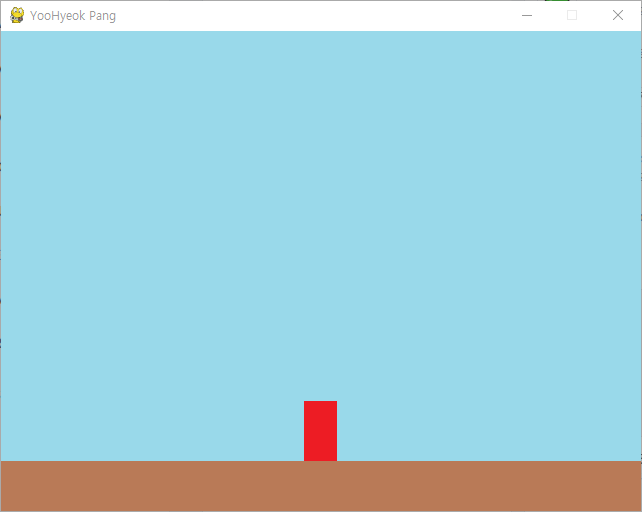
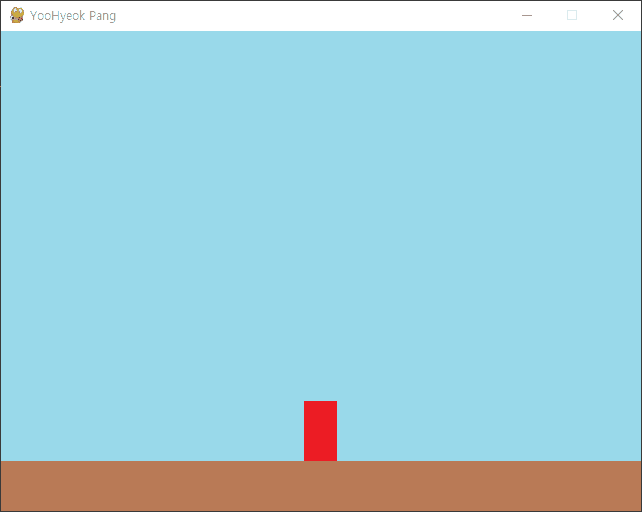
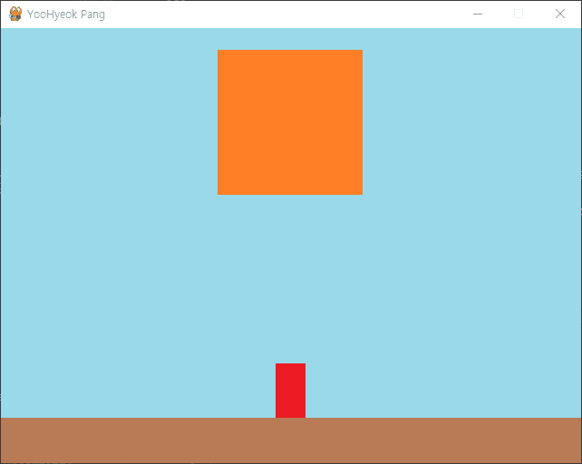
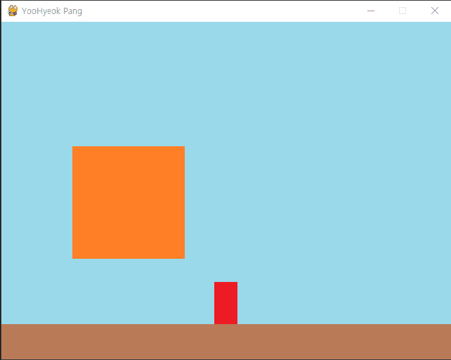

# [루트/README.md](../../README.md)
# [기본기](../../pygame_basic/docs/README.md)
# 오락실 Pang 게임 만들기

## [게임 조건]
1. 캐릭터는 화면 아래에 위치, 좌우로만 이동 가능
2. 스페이스를 누르면 무기를 쏘아 올림
3. 큰 공 1개가 나타나서 바운스
4. 무기에 닿으면 공은 작은 크기 2개로 분할, 가장 작은 크기의 공은 사라짐
5. 모든 공을 없애면 게임 종료 (성공)
6. 캐릭터는 공에 닿으면 게임 종료 (실패)
7. 시간 제한 99초 초과 시 게임 종료 (실패)
8. FPS 는 30 으로 고정 (필요시 speed 값을 조정)

## [게임 이미지]
1. 배경 : 640 * 480(가로 세로) - background.png
2. 무대 : 640 * 50 - stage.png
3. 캐릭터 : 33 * 60 - character.png
4. 무기 : 20 * 430 - weapon.png
5. 공 : 160 * 160, 80 * 80, 40 * 40, 20 * 20  
- balloon1.png ~ balloon4.png

# 예제1) 배경, 캐릭터
## 목차
A) 프레임 기본 설정  
  - 가로 : 640 / 세로: 480  
  
B) 이미지 출력   
  - 배경 출력  
  - 스테이지 출력
  - 캐릭터 출력

<br>
<details>
<summary>접기/펼치기</summary>
<br>

  

### A) 프레임 기본 설정
가로 : 640 / 세로: 480
- [1_frame_background_stage_character.py](../1_frame_background_stage_character.py)
  ```py
  from pathlib import Path
  import os
  import pygame

  pygame.init() # 초기화 (반드시 필요)

  # 화면 크기 설정
  screen_width = 640 # 가로 크기
  screen_height = 480 # 세로 크기
  screen = pygame.display.set_mode((screen_width, screen_height)) # 캔버스 설정 Surface 객체 변수 할당

  # 화면 타이틀 설정
  pygame.display.set_caption("YooHyeok Pang") # 게임 이름

  # FPS
  clock = pygame.time.Clock()

  running = True
  while running:
    dt = clock.tick(30)

    # 이벤트 처리 (키보드, 마우스 등)
    for event in pygame.event.get():
      if event.type == pygame.QUIT:
        running = False

    pygame.display.update() # 게임 화면 다시 그리기
  pygame.time.delay(2000) # 2초 대기

  # pygmae 종료
  pygame.quit()
  ```
### B) 이미지 출력
a) 배경 출력
  1. background 변수에 이미지 파일 경로 할당
  2. Surface 객체를 할당한 변수 screen에 blit(file, axis) 함수에 매개변수로 전달
      - 첫번째 매개변수에 이미지파일 경로 할당
      - 두번째 매개변수에 이미지를 출력할 초기 시작 좌표 할당.  
  3. 게임 실행 루프내에서 blit() 함수 호출
- [1_frame_background_stage_character.py](../1_frame_background_stage_character.py)
  ```py
  # 생략
    
  # background = pygame.image.load(str(Path(__file__).resolve().parent / "img" / "background.png"))
  background = pygame.image.load(os.path.join(os.path.join(os.path.dirname(__file__), "img"), "background.png"))

  running = True
  while running:
    # 생략
      
    # 화면에 렌더링
    screen.blit(background, (0, 0))
    pygame.display.update() # 게임 화면 다시 그리기

  # 생략
  ```

b) 스테이지 출력
  1. stage 변수에 이미지 파일 경로 할당
  2. Surface 객체를 할당한 변수 screen에 blit(file, axis) 함수에 매개변수로 전달
      - 첫번째 매개변수에 이미지파일 경로 할당
      - 두번째 매개변수에 이미지를 출력할 초기 시작 좌표 할당.  
        세로: 화면 기준 최하단 (스크린 높이 - 스테이지 높이)
  3. 게임 실행 루프내에서 blit() 함수 호출
- [1_frame_background_stage_character.py](../1_frame_background_stage_character.py)
  ```py
  # 생략
  stage = pygame.image.load(os.path.join(os.path.join(os.path.dirname(__file__), "img"), "stage.png"))
  stage_size = stage.get_rect().size

  running = True
  while running:
    # 생략
      
    # 화면에 렌더링
    screen.blit(stage, (0, screen_height - stage_height))
    pygame.display.update() # 게임 화면 다시 그리기

  # 생략
  ```

c) 캐릭터 출력
  1. character 변수에 이미지 파일 경로 할당
  2. Surface 객체를 할당한 변수 screen에 blit(file, axis) 함수에 매개변수로 전달
      - 첫번째 매개변수에 이미지파일 경로 할당
      - 두번째 매개변수에 이미지를 출력할 초기 시작 좌표 할당.  
        가로: 화면 기준 중앙 / 세로: stage 기준 상단
  3. 게임 실행 루프내에서 blit() 함수 호출

- [1_frame_background_stage_character.py](../1_frame_background_stage_character.py)
  ```py
  # 생략
    
  stage_height = stage_size[1] # 스테이지의 높이 위에 캐릭터를 두기 위해 사용
  
  character = pygame.image.load(os.path.join(os.path.join(os.path.dirname(__file__), "img"), "character.png"))
  character_size = character.get_rect().size
  character_width = character_size[0]
  character_height = character_size[1]
  character_x_pos = (screen_width / 2) - (character_width / 2)
  character_y_pos = screen_height - character_height - stage_height

  running = True
  while running:
    # 생략
      
    # 화면에 렌더링
    screen.blit(character, (character_x_pos, character_y_pos))
    pygame.display.update() # 게임 화면 다시 그리기

  # 생략
  ```
### 전체 코드
- [1_frame_background_stage_character.py](../1_frame_background_stage_character.py)
  ```py
  from pathlib import Path
  import os
  import pygame

  pygame.init() # 초기화 (반드시 필요)

  # 화면 크기 설정
  screen_width = 640 # 가로 크기
  screen_height = 480 # 세로 크기
  screen = pygame.display.set_mode((screen_width, screen_height)) # 캔버스 설정 Surface 객체 변수 할당

  # 화면 타이틀 설정
  pygame.display.set_caption("YooHyeok Pang") # 게임 이름

  # FPS
  clock = pygame.time.Clock()

  # 사용자 게임 초기화 (배경화면, 게임 이미지, 좌표, 속도, 폰트 등)

  # background = pygame.image.load(str(Path(__file__).resolve().parent / "img" / "background.png"))
  background = pygame.image.load(os.path.join(os.path.join(os.path.dirname(__file__), "img"), "background.png"))
  stage = pygame.image.load(os.path.join(os.path.join(os.path.dirname(__file__), "img"), "stage.png"))
  stage_size = stage.get_rect().size
  stage_height = stage_size[1] # 스테이지의 높이 위에 캐릭터를 두기 위해 사용
  character = pygame.image.load(os.path.join(os.path.join(os.path.dirname(__file__), "img"), "character.png"))
  character_size = character.get_rect().size
  character_width = character_size[0]
  character_height = character_size[1]
  character_x_pos = (screen_width / 2) - (character_width / 2)
  character_y_pos = screen_height - character_height - stage_height

  running = True
  while running:
    dt = clock.tick(30)

    # 이벤트 처리 (키보드, 마우스 등)
    for event in pygame.event.get():
      if event.type == pygame.QUIT:
        running = False
      
    # 화면에 렌더링
    screen.blit(background, (0, 0))
    screen.blit(stage, (0, screen_height - stage_height))
    screen.blit(character, (character_x_pos, character_y_pos))
    pygame.display.update() # 게임 화면 다시 그리기

  pygame.time.delay(2000) # 2초 대기

  # pygmae 종료
  pygame.quit()

  ```
</details>
<br>
<hr>
<br>

# 예제 2) 무기와 키보드 이벤트
## 목차

### 키보드 이벤트  
  1. 캐릭터 이동
    - 임계값 설정  
  3. 무기 발사(출력)
    - 무기 위치 이동, 최상단 근접시 제거

<br>
<details>
<summary>접기/펼치기</summary>
<br>


### 키보드 이벤트  
1. 케릭터 이동
    - [2_weapon_keyevent.py](../2_weapon_keyevent.py)
      ```py
      running = True
      while running:
        # 생략

        # 이벤트 처리 (키보드, 마우스 등)
        for event in pygame.event.get():
          if event.type == pygame.QUIT:
            running = False
          if event.type == pygame.KEYDOWN:
            if event.key == pygame.K_LEFT: # 캐릭터를 좌측으로 이동
              character_to_x -= character_speed
            elif event.key == pygame.K_RIGHT: # 캐릭터를 우측으로 이동
              character_to_x += character_speed

          # 방향키 해제시 stop
          if event.type == pygame.KEYUP:
            if event.key == pygame.K_LEFT or event.key == pygame.K_RIGHT:
              character_to_x = 0

        # 게임 캐릭터 위치 정의
        character_x_pos += character_to_x

        # 생략

      # 생략
      ```
2. 임계값 설정
    - [2_weapon_keyevent.py](../2_weapon_keyevent.py)
      ```py
      # 생략
      running = True
      while running:
        # 생략

        # 임계값
        if character_x_pos < 0:
          character_x_pos = 0
        elif character_x_pos > screen_width - character_width:
          character_x_pos = screen_width - character_widt
          
        # 생략

      # 생략
      ```

3. 무기 발사(출력)
    - 무기 정의 및 키보드 이벤트
      ```py
      # 무기
      weapon = pygame.image.load(os.path.join(os.path.join(os.path.dirname(__file__), "img"), "weapon.png"))
      weapon_size = weapon.get_rect().size
      weapon_width = weapon_size[0]

      # 무기목록 (1회 N발 발사)
      weapons = []
      weapon_speed = 10 # 무기 이동 속도

      running = True
      while running:
        # 생략

        # 이벤트 처리 (키보드, 마우스 등)
        for event in pygame.event.get():
          if event.type == pygame.KEYDOWN:
            # 생략
            # 무기 발사
            elif event.key == pygame.K_SPACE:
              weapon_x_pos = character_x_pos + (character_width / 2) - (weapon_width / 2) # 무기 위치 : 케릭터 중간위치
              weapon_y_pos = character_y_pos # 무기 위치 : 케릭터 상단위치
              weapons.append([weapon_x_pos, weapon_y_pos])
      ```
      - 발사될 무기는 배열로 정의하며, 무기의 속도는 10으로 정의한다.  
        무기를 배열로 정의하는 이유는 실시간으로 변경되는 캐릭터의 위치 기준으로 무기의 위치가 변경되기 때문에 SPACE 키가 입력되었을 때 배열에 정의하도록 구현하기 위해서이다.  
      - 발사될 무기는 SPACE 키가 입력되었을 때  캐릭터의 중간, 최상단에 위치시키고, 무기 배열에 추가한다.  

    - 무기 위치 조정
      ```py
      # 무기 위치 조정: 100(x), 200(y) → 180, 160, 140, ... / 500(x), 200(y) → 180, 160, 140, ...
      weapons = [ # 무기 위치 위로 발사 (출력할 무기 목록 할당)
        [w[0], w[1] - weapon_speed] for w in weapons 
          if w[1] > 0 # 무기 최상단 접근시 삭제: y좌표가 0보다 클 경우에만 무기 출력(출력할 무기 목록 할당)
      ]
      ```
      - 무기의 위치는 출력 후 위로 이동해야 하기 때문에 y좌표의 값을 게임 루프가 돌때마다 무기 속도만큼 감소시킨다.  
      - 반복문을 통해 무기 배열로 부터 x좌표와 y좌표를 얻은 후 y좌표에서 속도만큼 빼고, 기존 배열 형태로 재구성하여 무기 배열에 재할당시킨다.  

      - 이때, 만약 무기의 상단이 프레임의 최상단에 위치할 경우 해당 이동된 무기를 프레임에서 삭제시키기 위해 y좌표 값이 0보다 큰 경우 조건을 반복문 끝에 추가한다.

    - 실제 출력
      ```py
      screen.blit(background, (0, 0))
      # 무기 출력
      for weapon_x_pos, weapon_y_pos in weapons:
        screen.blit(weapon, (weapon_x_pos, weapon_y_pos))

      screen.blit(stage, (0, screen_height - stage_height))
      screen.blit(character, (character_x_pos, character_y_pos))
      ```
      x좌표와 y좌표 값을 2차원 배열형태의 배열에 할당하였으므로, 루프에서 꺼내 출력한다.  
      이때, 캐릭터의 상단위치에서 출력되어야 하므로, 배경 출력이후 & 스테이지와캐릭터 출력 이전에 출력되어야한다.


  - [2_weapon_keyevent.py](../2_weapon_keyevent.py)
    ```py
    # 생략

    # 무기
    weapon = pygame.image.load(os.path.join(os.path.join(os.path.dirname(__file__), "img"), "weapon.png"))
    weapon_size = weapon.get_rect().size
    weapon_width = weapon_size[0]

    # 무기목록 (1회 N발 발사)
    weapons = []
    weapon_speed = 10 # 무기 이동 속도

    running = True
    while running:
      # 생략

      # 이벤트 처리 (키보드, 마우스 등)
      for event in pygame.event.get():
        if event.type == pygame.QUIT:
          running = False
        if event.type == pygame.KEYDOWN:
          # 생략
          # 무기 발사
          elif event.key == pygame.K_SPACE:
            weapon_x_pos = character_x_pos + (character_width / 2) - (weapon_width / 2) # 무기 위치 : 케릭터 중간위치
            weapon_y_pos = character_y_pos # 무기 위치 : 케릭터 상단위치
            weapons.append([weapon_x_pos, weapon_y_pos])
        # 생략
        
      # 무기 위치 조정: 100(x), 200(y) → 180, 160, 140, ... / 500(x), 200(y) → 180, 160, 140, ...
      weapons = [ # 무기 위치 위로 발사 (출력할 무기 목록 할당)
        [w[0], w[1] - weapon_speed] for w in weapons 
          if w[1] > 0 # 무기 최상단 접근시 삭제: y좌표가 0보다 클 경우에만 무기 출력(출력할 무기 목록 할당)
      ]

      screen.blit(background, (0, 0))
      # 무기 출력
      for weapon_x_pos, weapon_y_pos in weapons:
        screen.blit(weapon, (weapon_x_pos, weapon_y_pos))

      screen.blit(stage, (0, screen_height - stage_height))
      screen.blit(character, (character_x_pos, character_y_pos))

    # 생략
    ```

</details>
<br>
<hr>
<br>

# 예제 3) 공 정의 및 공 튕기기

## 목차
a) 공 정의  
b) 공 튀기기  

<br>
<details>
<summary>접기/펼치기</summary>
<br>


### A) 공 정의  
1. 리스트 타입 ball_images 변수에 공 크기별 4개의 공 이미지 파일 경로 할당
2. 리스트 타입 ball_speed_y 변수에 공 크기에 따른 최초 속도 할당
3. 리스트 타입 공 목록 변수 ball 선언
4. dictionary 타입 초기 공 정의 및 balls 리스트에 append

```py
# 생략

# 공 만들기 (4개 크기에 대해 따로 처리)
ball_images = [
  pygame.image.load(os.path.join(os.path.join(os.path.dirname(__file__), "img"), "ballon1.png")),
  pygame.image.load(os.path.join(os.path.join(os.path.dirname(__file__), "img"), "ballon2.png")),
  pygame.image.load(os.path.join(os.path.join(os.path.dirname(__file__), "img"), "ballon3.png")),
  pygame.image.load(os.path.join(os.path.join(os.path.dirname(__file__), "img"), "ballon4.png")),
]

# 공 크기에 따른 최초 속도 정의
ball_speed_y = [-18, -15, -12, -9]

# 공 목록
balls = []

# 초기 공 정의
balls.append({
  "pos_x" : 50, # 공의 x좌표
  "pos_y" : 50, # 공의 y좌표
  "img_idx" : 0, # 공의 이미지 인덱스
  "to_x" : 3, # x축 이동 방향(-3: 좌측, 3: 우측)
  "to_y" : 3, # y축 이동 방향
  "init_spd_y" : ball_speed_y[0] # y축 최초 속도
})
# 생략
```
<br>
<hr>
<br>

### B) 공 튕기기
1. 공 위치 정의
  ```py
  # 생략
  running = True
  while running:
    # 생략

    for ball_idx, ball_val in enumerate(balls): # balls 리스트의 요소가 index, value - 각 공의 정보 처리로 인덱스 정보가 필요
      ball_pos_x = ball_val["pos_x"]
      ball_pos_y = ball_val["pos_y"]
      ball_img_idx = ball_val["img_idx"]

      ball_size = ball_images[ball_img_idx].get_rect().size
      ball_width = ball_size[0]
      ball_height = ball_size[1]
  ```

2. 공 임계값 처리
  ```py

  ```
  - 가로 벽 : 반대로 튕기기(부호반전 - 기존 to_x 속성에 * -1)
  - 세로 벽 : 스테이지 기준 속도 초기화
  - 그 외 속도 0.5 누적 증가
3. 공 렌더링
  ```py
  for idx, val in enumerate(balls):
    ball_pos_x = val["pos_x"]
    ball_pos_y = val["pos_y"]
    ball_img_idx = val["img_idx"]
    screen.blit(ball_images[ball_img_idx], (ball_pos_x, ball_pos_y))
  ```

```py
running = True
while running:
  # 생략

    # 생략

  # 생략

  # 공 위치 정의
  for ball_idx, ball_val in enumerate(balls): # balls 리스트의 요소가 index, value - 각 공의 정보 처리로 인덱스 정보가 필요
    ball_pos_x = ball_val["pos_x"]
    ball_pos_y = ball_val["pos_y"]
    ball_img_idx = ball_val["img_idx"]

    ball_size = ball_images[ball_img_idx].get_rect().size
    ball_width = ball_size[0]
    ball_height = ball_size[1]

    # 공 임계값 처리 - 반대로 튕기기
    if ball_pos_x < 0 or ball_pos_x > screen_width - ball_width: # 가로 벽
      ball_val["to_x"] = ball_val["to_x"] * (-1) # 반대로 튕기기(부호 반전)
    if ball_pos_y >= screen_height - stage_height - ball_height: # 세로 벽 : 스테이지 상단
      ball_val["to_y"] = ball_val["init_spd_y"] # 반대로 튕기기: 스테이지에 닿았기 때문에 최초 속도
    else: # 그 외 모든 경우 속도 증가
      ball_val["to_y"] += 0.5
    
    # x 좌표, y 좌표에 반영 공 위치 반영
    ball_val["pos_y"] += ball_val["to_y"]

  # 생략

  for idx, val in enumerate(balls):
    ball_pos_x = val["pos_x"]
    ball_pos_y = val["pos_y"]
    ball_img_idx = val["img_idx"]
    screen.blit(ball_images[ball_img_idx], (ball_pos_x, ball_pos_y))

  # 생략

  pygame.display.update() # 게임 화면 다시 그리기

# 생략
```

</details>
<br>
<hr>
<br>

# 예제 4) 충돌 처리
## 목차
a) 공 ↔ 캐릭터 : 게임 종료  
b) 공 ↔ 무기 : 공 제거  

<br>
<details>
<summary>접기/펼치기</summary>
<br>



### A) 공 ↔ 캐릭터 : 게임 종료
1. 캐릭터 rect 정보 업데이트
    ```py
    # 생략
    while running:
      # 생략 (이벤트 처리, 임계값 처리)

      # 공 위치 정의
      for ball_idx, ball_val in enumerate(balls):
        # 생략

        # 캐릭터 rect 정보 업데이트
        character_rect = character.get_rect()
        character_rect.left = character_x_pos
        character_rect.top = character_y_pos

      # 생략
    # 생략
    ```
2. 공 rect 정보 업데이트
    ```py
    # 생략
    while running:
      # 생략 (이벤트 처리, 임계값 처리)

      # 공 위치 정의
      for ball_idx, ball_val in enumerate(balls):
        # 생략

        # 캐릭터 rect 정보 업데이트
        # 생략

        # 2. 공 rect 정보 업데이트
        for ball_idx, ball_val in enumerate(balls):
          ball_pos_x = ball_val["pos_x"]
          ball_pos_y = ball_val["pos_y"]
          ball_img_idx = ball_val["img_idx"]

          # 공 rect 정보 업데이트
          ball_rect = ball_images[ball_img_idx].get_rect()
          ball_rect.left = ball_pos_x
          ball_rect.top = ball_pos_y

      # 생략
    # 생략
    ```
3. 실제 충돌 처리
    ```py
    # 생략
    while running:
      # 생략 (이벤트 처리, 임계값 처리)

      # 공 위치 정의
      for ball_idx, ball_val in enumerate(balls):
        # 생략

        for ball_idx, ball_val in enumerate(balls): 
          # 생략

          # 캐릭터 rect 정보 업데이트
          # 생략

          # 충돌 처리
          if character_rect.colliderect(ball_rect): # 공 ↔ 캐릭터
            running = False
            break

      # 생략
    # 생략
    ```
### B) 공 ↔ 무기 : 공 제거  
1. 무기 rect 정보 업데이트
    ```py
    # 생략
    while running:
      # 생략 (이벤트 처리, 임계값 처리)

      # 공 위치 정의
      for ball_idx, ball_val in enumerate(balls):
        # 캐릭터 rect 정보 업데이트
        # 생략

        for ball_idx, ball_val in enumerate(balls): 
          # 생략

          # 충돌 처리 (공 ↔ 캐릭터)
          # 생략

          # 무기 rect 정보 업데이트
          for weapon_idx, weapon_val in enumerate(weapons): # 공 ↔ 무기
            weapon_pos_x = weapon_val[0]
            weapon_pos_y = weapon_val[1]

            weapon_rect = weapon.get_rect()
            weapon_rect.left = weapon_pos_x
            weapon_rect.top = weapon_pos_y
      # 생략
    # 생략
    ```
2. 충돌 처리 및 무기 제거
    ```py
    # 생략
    while running:
      # 생략 (이벤트 처리, 임계값 처리)

      # 공 위치 정의
      for ball_idx, ball_val in enumerate(balls):
        
        # 캐릭터 rect 정보 업데이트
        # 생략

        # 공 rect 정보 업데이트
        for ball_idx, ball_val in enumerate(balls): 
          # 생략

          # 무기 rect 정보 업데이트
          for weapon_idx, weapon_val in enumerate(weapons): # 공 ↔ 무기
            # 생략

            # 충돌 처리
            if ball_rect.colliderect(weapon_rect): # 공 ↔ 무기
              weapon_to_remove = weapon_idx # 무기 제거를 위한 값 할당
              ball_to_remove = ball_idx # 현재 공 제거를 위한 값 할당
              break

      # 충돌된 공 혹은 무기 제거
      if ball_to_remove > -1:
        del balls[ball_to_remove]
        ball_to_remove = -1 
      if weapon_to_remove > -1:
        del weapons[weapon_to_remove]
        weapon_to_remove = -1
      # 생략
    # 생략
    ```

### 최종 코드
```py
# 생략
while running:
  # 생략 (이벤트 처리, 임계값 처리)
  
  # 공 위치 정의
  for ball_idx, ball_val in enumerate(balls):
    # 생략
    # 캐릭터 rect 정보 업데이트
    character_rect = character.get_rect()
    character_rect.left = character_x_pos
    character_rect.top = character_y_pos

    # 공 rect 정보 업데이트
    for ball_idx, ball_val in enumerate(balls): 
      ball_pos_x = ball_val["pos_x"]
      ball_pos_y = ball_val["pos_y"]
      ball_img_idx = ball_val["img_idx"]
      ball_rect = ball_images[ball_img_idx].get_rect()
      ball_rect.left = ball_pos_x
      ball_rect.top = ball_pos_y

      # 실제 충돌 처리
      if character_rect.colliderect(ball_rect): # 공 ↔ 캐릭터
        running = False
        break

      for weapon_idx, weapon_val in enumerate(weapons): # 공 ↔ 무기
        weapon_pos_x = weapon_val[0]
        weapon_pos_y = weapon_val[1]

        weapon_rect = weapon.get_rect()
        weapon_rect.left = weapon_pos_x
        weapon_rect.top = weapon_pos_y

        if ball_rect.colliderect(weapon_rect): # 공 ↔ 무기
          weapon_to_remove = weapon_idx # 무기 제거를 위한 값 할당
          ball_to_remove = ball_idx # 현재 공 제거를 위한 값 할당
          break

  # 충돌된 공 혹은 무기 제거
  if ball_to_remove > -1:
    del balls[ball_to_remove]
    ball_to_remove = -1 
  if weapon_to_remove > -1:
    del weapons[weapon_to_remove]
    weapon_to_remove = -1
  # 생략
# 생략
```


### 중복 코드 제거
현재 공 위치 정의를 공 위치 정의 loop 내부에서 중복으로 정의하고있다.  
캐릭터 rect 정보 업데이트 로직을 공 위치 정의 최상위 loop 외부로 옮기고  
임계값 처리 및 ball x,y좌표 초기화 종료 후 공 rect 정보 업데이트를 반영된 좌표를 기준으로 초기화해준다.  
이후 실제 충돌처리 로직을 배치한다.  
```py
while running:
  # 생략 (이벤트 처리, 임계값 처리)

  # 4. 충돌 처리
  # 캐릭터 rect 정보 업데이트
  character_rect = character.get_rect()
  character_rect.left = character_x_pos
  character_rect.top = character_y_pos

  # 공 위치 정의
  for ball_idx, ball_val in enumerate(balls): # balls 리스트의 요소가 index, value - 각 공의 정보 처리로 인덱스 정보가 필요하다.
    ball_pos_x = ball_val["pos_x"]
    ball_pos_y = ball_val["pos_y"]
    ball_img_idx = ball_val["img_idx"]

    ball_rect = ball_images[ball_img_idx].get_rect()
    ball_size = ball_rect.size
    ball_width = ball_size[0]
    ball_height = ball_size[1]

    # 공 임계값 처리 - 반대로 튕기기
    if ball_pos_x < 0 or ball_pos_x > screen_width - ball_width: # 가로 벽
      ball_val["to_x"] = ball_val["to_x"] * (-1) # 반대로 튕기기(부호 반전)
    if ball_pos_y >= screen_height - stage_height - ball_height: # 세로 벽 : 스테이지 상단
      ball_val["to_y"] = ball_val["init_spd_y"] # 반대로 튕기기: 스테이지에 닿았기 때문에 최초 속도
    else: # 그 외 모든 경우 속도 증가
      ball_val["to_y"] += 0.5
    
    # x 좌표, y 좌표에 반영 공 위치 반영
    ball_val["pos_x"] += ball_val["to_x"]
    ball_val["pos_y"] += ball_val["to_y"]

    # 4. 충돌 처리
    # 공 rect 정보 업데이트
    ball_rect.left = ball_val["pos_x"]
    ball_rect.top = ball_val["pos_y"]

    # 실제 충돌 처리
    if character_rect.colliderect(ball_rect): # 공 ↔ 캐릭터
      running = False
      break

    # 공 ↔ 무기
    for weapon_idx, weapon_val in enumerate(weapons):
      weapon_pos_x = weapon_val[0]
      weapon_pos_y = weapon_val[1]

      weapon_rect = weapon.get_rect()
      weapon_rect.left = weapon_pos_x
      weapon_rect.top = weapon_pos_y

      if ball_rect.colliderect(weapon_rect): # 공 ↔ 무기
        weapon_to_remove = weapon_idx # 무기 제거를 위한 값 할당
        ball_to_remove = ball_idx # 현재 공 제거를 위한 값 할당
        break

  # 충돌된 공 혹은 무기 제거
  if ball_to_remove > -1:
    del balls[ball_to_remove]
    ball_to_remove = -1 
  if weapon_to_remove > -1:
    del weapons[weapon_to_remove]
    weapon_to_remove = -1
```

</details>
<br>
<hr>
<br>

# 예제 ) 
## 목차

<br>
<details>
<summary>접기/펼치기</summary>
<br>


</details>
<br>
<hr>
<br>